# Contents
1. Critical Thinking
    1. Importance
    2. Skills
    3. The process
    4. Modes of thinking 
    5. Enquiry-based learning
    6. Debating
    7. Persuasion
2. Project environments
    1. Projects vs. BAU
    2. Software development methodologies
    3. Making projects

 
 

# 1. Critical thinking

**Why is it important?**
* Helps create strong arguments through proper justification of your claims
* Allows you to contribute to any role -- a very transferable skill

 **Skills**
* Seek out all sides of an argument
* Check the facts and evidence and respond objectively to them
* Levels of Intellectual skill:  

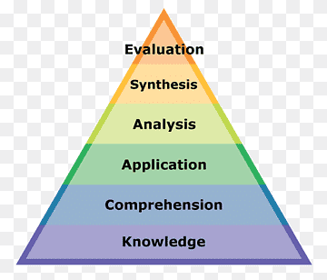

 **The process**
1. Identify
    * Find the main points of the argument, the claims made, the evidence used, and the conclusions they have reached
2. Analyse
    * Does the evidence really make sense in relation to other research?
    * How old is the material being used?
    * Do you need more information to aid understanding?
    * Does the arguement present a balanced view or are some topics disregarded?
3. Apply
    * Look for the implications of the other information 
    * Look out for weaknesses of the argument and for lack of coverage in the topic

 **The three modes of thinking**
* Divergent thinking, convergent thinking, and lateral thinking (both)
* Divergent is imagination and convergent is logical -- best to use both

 **Enquiry-based learning**
* The enquiry cycle:  
    - Enquire  
    - Investigate  
    - Create  
    - Discuss  
    - Reflect  

* Consider:
    1. What is the source of the evidence?
    2. What are the claims and is there evidence for them?
    3. How clear are the points and is it really a balanced argument?

**Arguments and debating**
* Structure:
    * Have a claim, present evidence to support it, and then explain the significance of it
* Coherence:
    * Do the claims make logical sense?
    * Are they based on supporting evidence?
    * Does the supporting evidence really support all the claims made, and is their evidence still relevant now?
    * Quality of evidence = quality of data + quality of interpretation
* Phrase arguments objectively
* Logical fallacies to look out for:
    1. False dichotomy  
        When the speaker forces the debate into two possible outcomes despite the possibility of more
    2. Assertion  
        When the speaker presents a statement as fact despite it being an assumption or being invalid
    3. Morally flawed  
        Arguments that go against ethics and morals
    4. Correlation is not causation  
        A speaker mistaking correlation with direct causation
    5. Failure to deliver promises  
        Speaker might fail to complete a task they promised to deliver
    6. Strawman  
        Creating another stance -- one that wasn't even stated -- to debate against
    7. Contradiction  
        The speaker contradicts something they said earlier, reducing their credibility
    8. Compare conclusion to reality  
        Considers what would happen if the motion became reality
        which usually shows it's more complicated than being suggested

 **The art of persuasion**
* Three pillars of rhetoric:
    1. Ethos  
        Appeal through authority or credibility
    2. Pathos  
        Appeal through emotional empathy
    3. Logos  
        Appeal through logic and reasoning

**Important skills for debating:**
1. Keep points relevant
2. Provide objective evidence not personal experience

    Do:
    * Be prepared and stay calm
    * Speak clearly + confidently and keep language simple
    * Actively listen

    Don't:
    * Falsify evidence
    * Publicly disagree with the decision
    * Attack the speaker as opposed to their motion
    * Act aggressively or interrupt other

 

# 2. Project environment
**Project vs. BAU**
* BAU = "Business as usual" 
* Project refers to a task to be accomplished and is unique
* BAU is ongoing whereas projects are usually restricted to a time-frame and could be entirely separate from BAU

**Triple constraint is:**

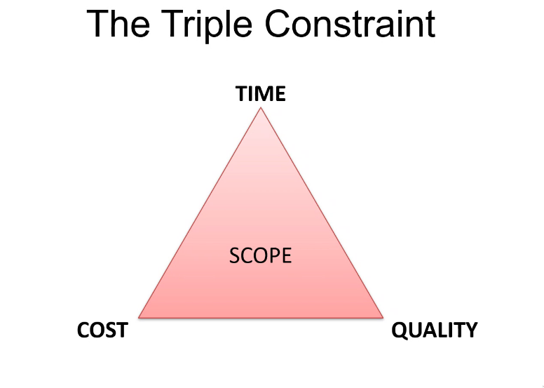

* One must choose what to compromise in terms of each other
* For example, a higher quality product would most likely cost more and take more time

**The POPIT model = The Holistic model**
* These are the aspects one must consider when researching a new business project (for example)
- P = People  
O = Organisation  
P = Processes  
IT = Information Technology

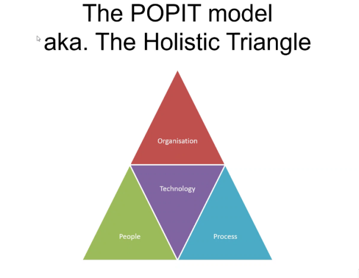

----
 Software Development Methodologies:

* Waterfall:

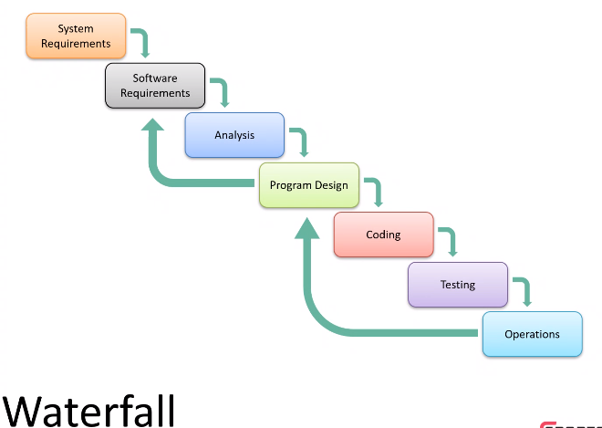

* V-model:

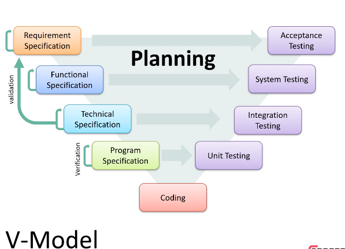

* Agile:

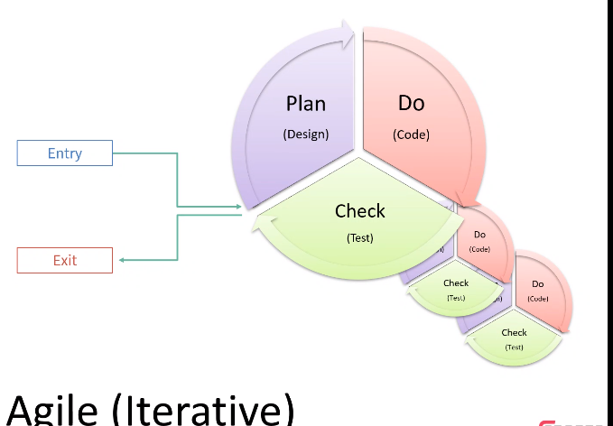

* Scrum framework:

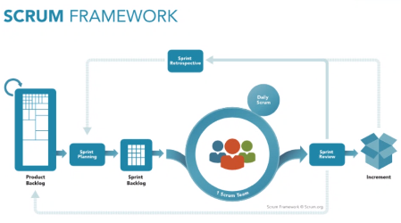

Scrum is related to Agile

* Management plans and SDLCs (software development cycles)

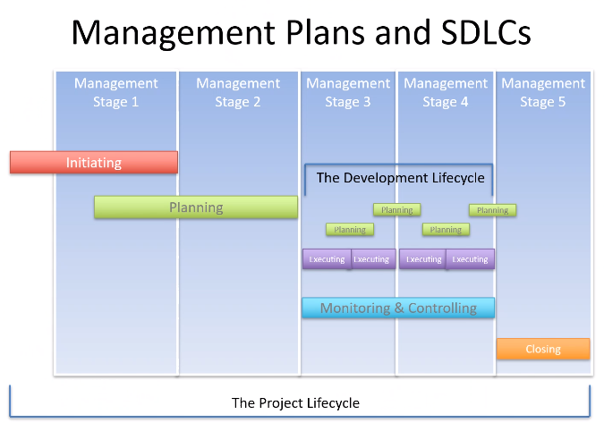

 

 **One team**
* Attributes of mature teams:
    * They are located in the same place
    * They have cross-functional roles
    * Each role is self-organising and is accountable for their share of work
    * They test and learn feedback loops

* The usual roles are:  
    - PM (project manager),   
    - QA (quality assurance),  
    - UX (user experience designers),  
    - DEV's (developers),  
    - BA's (business analysts)

* Projects are difficult so try to:
    * Maintain a positive atmosphere
    * Manage conflict smartly
    * Have open and clear communication

  

 **Making a project**

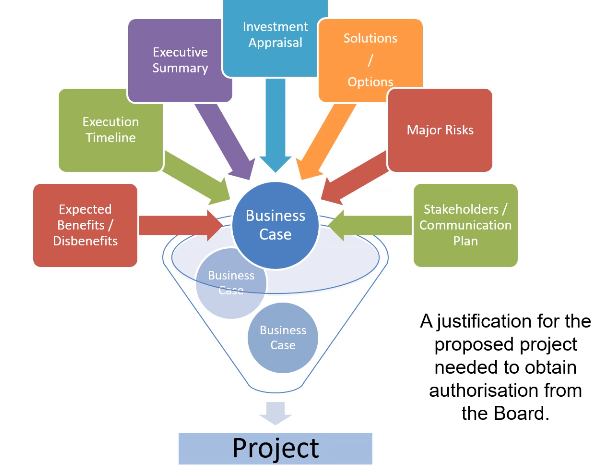

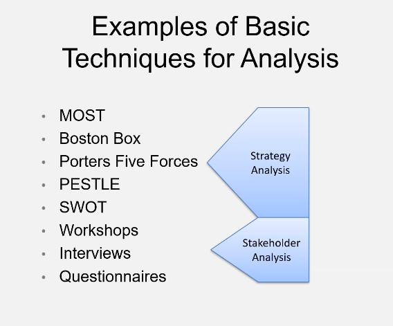

* ROI (return of investment) is important and essential when considering the risk associated with the investment
* It all comes down to the value the product has to the people that need it (or use it)

 

**Risk**
* It is important to identify risk to prevent potential disasters
* Some sources can be:
    * Technology 
    * Scope
    * Business
    * Economy
    * Potential competition

* Dealing with risk:
    * Avoid it altogether
    * Transfer who has to deal with the risk
    * Try to reduce it if it happens
    * Accept the risk (maybe if not too negative a risk)
    * Share the risk
    * Exploit the risk
    * Enhance the risk (aim to modify risk exposure)
    * Ignore the risk (must be justified if you do)

* A stakeholder is someone who is interested in the company e.g. customers, investors, workers, regulators, shareholders etc.

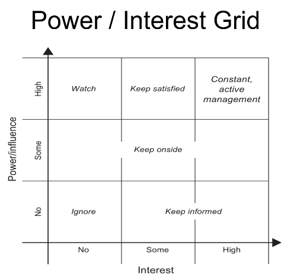

* Stakeholder attitudes:
    * Champions fight for the cause of the project -- possibly through logical reasoning
    * Supporters aren't champions but still do support the cause, however they won't actively reason for it
    * Neutral is neutral
    * Critics will input things why not to do the project
    * Opponents actively against the project
    * Blockers are entirely against the project and do their best to stop it

 

----
### Exercises
* Presentation on Agile and Scrum:
    - Included: what they are, potential benefits, how it relates to DevOps, scrum artefacts, roles and ceremonies etc.
* DOD = "Definition of done"
