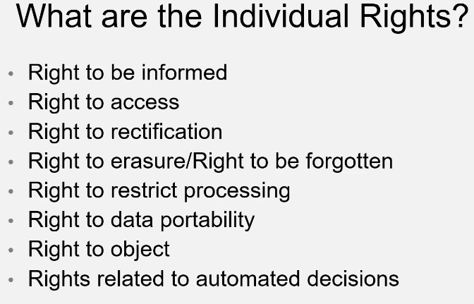

# Contents
1. Feedback for Agile presentations 
2. GDPR
    1. What it is and why it's important
    2. What constitutes a breach?
    3. Types of data
3. Cybersecurity
    1. Best practices etc.
4. Interviewing skills
----

### 0. Solid foundation
* Core competencies, communication skill, your profile and technical skills all need to be solid, if one is weaker than the others it won't be good

### 1. Presentation Feedback
* Certain colours are more appealing and more rememberable e.g. yellow, red (pay attention to what the background is)
* Try to include pictures for more interaction with viewers -- have images be a good quality so they're readable
* Avoid "/" in headings e.g. "Sprints and Iterations" instead of "Sprints/Iterations"
* CMADE = confidence, manner, attitude, diligence, enthusiasm
* If something is missing, don't highlight it and just continue with your own information

-----

### 2. GDPR
* What is it?
    * The General Data Protection Regulation
    * Came into force on 25th May 2018
    * Gives everyone across the EU protection for their personal data
    * It defines what constitutes personal data
    * Companies with businesses in the EU must comply with it even if they aren't based in the EU

* Key changes:
    * Increased scope
    * Penalties
    * Consent

* Penalties:
    * If a company breaches the GDPR, there are two tiers of fines:
        1. Up to 20 million or up to 4% of the company's annual turnover -- whichever is greater  
        Used when breach of sensitive data
        2. Up to 10 million or up to 2% of the company's annual turnover -- whichever is greater  
        Used when breach of personal data

    * Other penalties include:
        * Warnings and reprimands
        * A temporary or permanent ban on data processing
        * Ordering the rectification, restriction or erasure of data
        * Suspends data transfers to third parties

* What constitutes a breach?
    * Breaches of an individual's rights and freedoms in relation to their data
    * Breaches of obligations by the data processor

*  Who does the regulation apply to?
    * Controllers
    * Processors
    * Any company that has business in the EU
    * Everyone

* Types of data:
    * Personal
        * Something that can be used to identify someone
        * e.g. name, address, email, number, D.O.B. etc.
    * Sensitive
        * Data that reveals political beliefs, racial or ethnic origin etc.
        * e.g. gender, medical conditions etc.

    

* Other obligations:
    * Must assign a DPO (data protection officer)
    * Inform the ICO of data breaches within 72 hours
    * Every company must update their privacy policies, by law

* Storing and processing data:
    * Paper copies
        * Could be lost or damaged and hence should be kept securely and destroyed when obsolete
    * Emails
        * Insecure
    * Spreadsheets
    * Databases

* Databases:
    * When you add someone to a database, that individual has the right to access their information at any time
    * Do not add comments in a database you would not be comfortable saying in person

* Maintaining confidentiality
    * Dispose confidential data securely and safely
    * Protect print-outs
    * Password encryption
    * Lock machines and keep a clear disk
    * Avoid storing data on portable drives (CD's and USB's)

----
### 3. Cyber Security
* Why is it important?
    * Underpins and protects the core functions of every organisation
    * All staff should be aware of good practices

* Types of attacks:
    * Vishing, smishing, phishing
        * Voice fishing, using sms to gain information, emails that look legitimate to trick users into revealing personal data or downloading malware
    * Impersonation
        * Someone pretending to be someone else
    * Waterholing
    * Malware and ransomware

* Social engineering   
    - Six key principles to be aware of:
        1. Reciprocity  
        2. Commitment and consistency
        3. Social proof
        4. Liking
        5. Scarcity

* Countermeasures
    - Defend against phishing
    - Monitor your digital footprint
    - Secure devices 
    - Internet usage
    - Training employees
    - Security protocols

---

### 4. Interviewing skills

### Benefits of using STAR

- S = Situation
- T = Task
- A = Action
- R = Result

**Articulate your answers using STAR with examples**

### What is an Elevator pitch (TMY)?
- It's a quick-fire presentation on something. In this case, it would be a quick introduction to sell yourself to a potential client.

---
### Task

**Create an elevator pitch for maximum 1 minute and present back to the group**

Why do you want to work in DevOps

Why did you go from a maths degree into this

- Intro - name
- Background
- Key Achievements/ Recent achievements
- Why DevOps or why the organisation
- Your presentation of yourself must be professional + positive + passionate
- PRACTICE PRACTICE PRACTICE
---
 **The task was completed in other repositories**

 **Check elevator_pitch and elev_pitch2**

