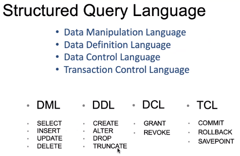
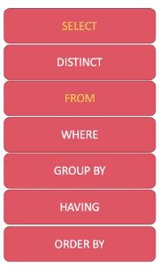

**NTK**
- Can't use aliases in WHEN statements as they aren't part of the table
    ```sql
        SELECT Quantity*Price AS 'GrossProfit'
        FROM Orders
        WHERE 'GrossProfit' > 1000;
        -- You can't condition on 'GrossProfit' because it doesn't exist in the table
    ```

**Wildcards**
- msSQL not case-sensitive

```sql
    % -- represents zero or more characters
    _ -- represents a single character
    [list] -- sets and ranges of characters to match
    [^list] -- sets and ranges of characters to NOT match
```

```sql
    a% -- finds all values that start with a
    %a -- finds all values that end with a
    h_t -- e.g. finds hot, hat, hit (among possibly others)
    h[oa]t -- finds hot, hat but not hit
    h[^oa]t -- finds every value EXCEPT hot, hat
    h[a-d]t -- finds hat, hbt, hct, hdt
    h[^a-d]t -- finds every value EXCEPT hat, hbt, hct, hdt
```
``` sql
    SELECT first_name FROM table_name WHERE first_name LIKE 'J%';
    -- returns all names in the table that start with a J (not case-sensitive)

    SELECT first_name FROM table_name WHERE first_name LIKE '%d';
    -- returns all names in the table ending with a d (not case-sensitive)

    SELECT first_name FROM table_name WHERE first_name LIKE 'J____';
    -- returns all names that start with a J and are 5 letters long
```

**DDL Syntax**
```sql
    CREATE DATABASE <DBname>;

    CREATE TABLE <tablename>
    (
        <col1> <datatype>,
        <col2> <datatype>,
        ...
    ); 
    -- creates a table within a database with column names col1, col2 etc.

    INSERT INTO <table name> (<col1>, <col2>, ...) 
    VALUES (<val1>, <val2>, ...),
            (<val1>, <val2>, ...),
            ...; 
    -- inserts values into a table

    UPDATE <tablename>
        SET <colname1> = <value1>
        WHERE <condition>;
    -- changes the value of colname1 to value1 where conditions are met
    -- without the WHERE clause, it would update all rows in the column

    ALTER TABLE <tablename> 
    ADD <colname> <datatype>;
    -- adds a column with that name and datatype

    ALTER TABLE <tablename>
        ALTER COLUMN <colname> <changes>;
    -- e.g. can change a column to be NOT NULL or NULL
    -- maybe also change the datatype of that column etc.

    DELETE FROM <tablename> WHERE <condition>;
    -- deletes all rows where the condition is met
    -- without the WHERE clause, it would delete all rows in the table

    DROP <table>|<database> <name>;
    -- deletes the table or database with that name

    TRUNCATE TABLE <tablename>;
    -- TRUNCATE deletes all data in the table but NOT the table itself
    -- it will leave a blank table with no columns
```


**DML Syntax**
```sql
    SELECT * FROM <table>;
    -- Returns all rows in the table
    
    SELECT * FROM <table> WHERE <condition>;
    -- Returns all rows in the table that satisfy a condition

    SELECT <col> AS <name> FROM <table> WHERE <condition>;
    -- AS returns all rows under the heading "name" that satisfy a condition

    SELECT DISTINCT <col> FROM <table> WHERE <condition>;
    -- DISTINCT returns all distinct values in the given column that meet the criteria

    SELECT COUNT(<col>) FROM <table> WHERE <condition>;
    -- COUNT returns the number of rows that matches the condition
    
    SELECT SUM(<col>) FROM <table> WHERE <condition>;
    -- SUM returns the total sum of values in a numeric column meeting the condition
    
    SELECT AVG(<col>) FROM <table> WHERE <condition>;
    -- AVG returns the average of all values in a numeric column meeting the conditions

    SELECT TOP <number> FROM <table> WHERE <condition>;
    -- TOP returns the top <number> results in the table meeting the condition

    SELECT TOP <number> PERCENT FROM <table> WHERE <condition>;
    -- TOP PERCENT returns the top percentage of results ...

    SELECT * FROM <table> ORDER BY <col 1>, <col 2> DESC;
    -- ORDER BY orders the table based on values in col1, col2 in descending order
    -- Can use ORDER BY ___ ASC to order by ascending order

    SELECT COUNT(DISTINCT <col>) FROM <table>;
    -- COUNT(DISTINCT col) returns the number of distinct values in the column

    SELECT * FROM <table> WHERE <col> IN (val1, val2, val3);
    -- WHERE IN returns rows where the values in the column are in the tuple
    -- Can use WHERE NOT IN to return rows with column values NOT in the tuple

    SELECT * FROM <table> WHERE <col> BETWEEN val1 AND val2;
    -- BETWEEN returns rows where the value in col are between val1 and val2

    SELECT * FROM <table> WHERE CHARINDEX('''', <col>) > 0;
    -- CHARINDEX is a string function
    
 ```


