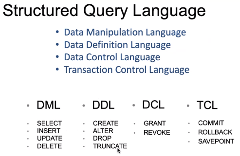

# SQL

**Terminology**
- What is a database?
    - Somewhere you gather and store information in a structured way.
    - e.g. Excel spreadsheets, Google searches etc.

- We must be able to structure DB's with the right type of data so we can query it.

- DBMS = Data Base Management System
    - Allows a computer to perform database functions such as storing, retrieving, adding, deleting and modifying data (among other things).

- _Relational databases_ contain data related to one another. So a book review table can contain information such as 'author id' which we need a database containing Authors and their author id's to find them.


**Building DB's**
- Types of DB's:
    - Flat-file
        - Stores everything in one table (e.g. excel)
    - Relational
        - Ability to separate data into numerous tables
        - Linked through keys
        - This is the main one we will be using.
    - Big Data
        - MongoDB, Vertica
        - Used for data analytics and business intelligence

**Relational databases**
- Types:  
[Explanation](https://fmhelp.filemaker.com/help/18/fmp/en/index.html#page/FMP_Help%2Fmany-to-many-relationships.html%23)
    - One-to-one
        - Not used often.
        - In a one-to-one relationship, one record in a table is associated with one and only one record in another table. For example, in a school database, each student has only one student ID, and each student ID is assigned to only one person.

        

    - One-to-many
        - In this example the primary key field in the Customers table, Customer ID, is designed to contain unique values. The foreign key field in the Orders table, Customer ID, is designed to allow multiple instances of the same value.

        

    - Many-to-many
        - The following example includes a Students table, which contains a record for each student, and a Classes table, which contains a record for each class. A join table, Enrollments, creates two one-to-many relationships—one between each of the two tables.

        

        

- The diagrams are called ERD/ER diagrams (entity relationship diagrams).

    

- Primary key:
    - The unique identifier that identifies each record in the table.
    - Tables *should* have a Primary key.
    - Can be an already unique number (e.g. NI number) or can be generated by the DBMS.
    - THe DBMS will enforce the uniqueness of the Primary Key, not allowing repeated records to exist in the table.

    - Constraints:
        - PK's should be unique and entries can't be NULL.
        - Value must never change.
        - Each table must have a maximum of one PK.

    - Two types of primary keys:
        1. Simple
        2. Composite
            - Combines two or more fields to create a primary key

        

- Foreign key:
    - It's a primary key that exists in a secondary table. It builds the relationship to the primary table.
    - FK's ensure that the row in table A corresponds to the correct row in table B.
    - The constraint is used to prevent actions that would destroy links between tables.
    - No uniqueness -- a table can have multiple FK's.
    - Prevents invalid data from being inserted into the foreign key column, because it has to be one of the values contained in the table it points to.

        

        


**Database tools**
- Examples:
    - Microsoft Access
    - SQL server
    - PostgreSQL
    - SQLite
    - MySQL
    - Redis
    - mongoDB
    - Oracle

- DML, DDL, DCL and TCL


    

**Example Code**
- ```sql
    USE <database name>;

    CREATE TABLE <table name> (
        <column name> <data type>,
        <column name> <data type>,
        ...
    );
    -- USE ensures you query the correct table
    -- CREATE TABLE creates a table
    ```

- ```sql
    SELECT * FROM <table name>;
    -- Lists everything the table (all rows and columns)
    ```

- ```sql
    DROP TABLE film_table
    -- This deletes the corresponding table
    ```

- ```sql
    ALTER TABLE <table name>
    ADD <column name> <datattype>;
    -- ADD creates a column in the specified table
    ```

- ```sql
    ALTER TABLE <table name>
        ALTER COLUMN <existing column name> <data type> NOT NULL;
    -- ALTER changes an exisiting column
    -- This one specifically changes the column to not accept NULL values
    ```

- ```sql
    INSERT INTO <table>
    ( <column name 1>, <column name 2>, ...)
    VALUES
    ( <value 1>, <value 2>, ...);
    -- This inserts a row into the table with the specified values in the columns
    ```

<br>
<br>

**Example 1**

- ```sql
    CREATE TABLE people(
        person_id INT NOT NULL IDENTITY PRIMARY KEY,
        person_name VARCHAR(20),
        height DECIMAL,
        is_happy BIT
    );
    -- creates a table called people with the person id as the PK, the person's name, their height and if they're happy or not (1 or 0)
    ```

- ```sql
    INSERT INTO people
    (person_name)
    VALUES
    ("Filipe");
    -- Inserts "Filipe" into the table
    ```

- ```sql
    UPDATE people
        SET person_name = 'Daisy'
        WHERE person_id = 2;
    -- have to use the WHERE clause otherwise it will update the entire table
    -- sets the person with id = 2 to have the name Daisy
    ```

- ```sql
    DELETE FROM people
    WHERE person_id = 3;
    -- Deletes the person with corresponding id = 3
    -- without the WHERE clause, it would just delete all entries from people
    ```

- Data types:
    - [Microsoft documentation](https://docs.microsoft.com/en-us/sql/t-sql/data-types/data-types-transact-sql?view=sql-server-ver15)
    - VARCHAR
        - Adaptable to different lengths of characters.
    - CHARACTER or CHAR
        - Fixed length data.
    - INT
        - Holds an integer (see bigint, smallint and tinyint)
    - DATE or TIME or DATETIME
        - Stores date, time or datetime
    - DECIMAL or NUMERIC
        - Fixed precision and scale
    - BINARY
        - Used to store binary data such as images or files
    - FLOAT
        - Scientific use (very large numbers)
    - BIT
        - Either 0 or 1 or NULL

- NULL has no value. One can make a column accept NULL values or not.
    - One can also give a DEFAULT value instead of giving a NULL value when data hasn't been inserted into it.

- You can specify which column represents the Primary Key.

<br>

---
**Used:**
- [Relational databases pictures](https://fmhelp.filemaker.com/help/18/fmp/en/index.html#page/FMP_Help%2Frelationships.html%23)
- [MSSQL Datatypes](https://docs.microsoft.com/en-us/sql/t-sql/data-types/data-types-transact-sql?view=sql-server-ver15)