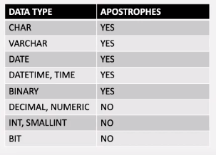

# Normal Forms

**1st Normal Form**

1. Everything is atomic and data cannot be split up anymore.
        - e.g. first_name and last_name NOT just one name
2. No repeating groups

- Each cell should contain a single value
- Each record needs to be unique


<br>

**2nd Normal Form**

1. Be in 1NF
2. All non-key columns are fully dependent on the PK.


**3rd Normal Form**

1. Be in 2NF
2. Contains only columns that are non-transitively dependent on the PK.

- What is a transitive dependence?
    - If a column depends upon another column through another column.

- In the example:
    1. 'Bank' is dependent on 'Bank_Code_no' which is dependent on 'ID'. 
    2. Hence there is a transitive dependency between 'Bank_Code_No' and 'Bank' since 'Bank_Code_No' is not the primary key of this relation.
    3. We must create a new table with 'Bank_Code_No' and 'Bank'.


**SQL as a Tester**
- Getting data for testing
- Saving data that is generated from testing acitivities
- Data verifications in DB's
- Testing DB's

**SQL as a DevOps Engineer**
- Environments need DB's (set these up and maintain them)
- Data verifications in DB's and testing DB's

# Querying an SQL database

**SELECT**


- DISTINCT refers to distinct column names separated by commas.

**Datatypes and apostrophes**




---
**What we went through**
- SELECT FROM WHERE
- TOP
- COUNT 
- DISTINCT
- WHERE
- AND
- OR
- SELECT DISTINCT
- ```sql 
    SELECT COUNT(DISTINCT Country) FROM table;
    -- This would return the number of distinct countries in the table.
    ```
- IN
- BETWEEN
- AS
- IS
- ORDER BY DESC
- ORDER BY ASC

**Wildcards**
- ```sql
    \* -- used for everything
    % -- a substitute for zero or more characters
    _ -- a substitute for a single character
    [charlist] -- gives a list or range of characters
    [^charlist] -- gives a list or range of characters you dont want to match
    ```

- ```sql
    SELECT name FROM table WHERE name LIKE '%d';
    -- this returns all names in the table that ends with a d
    
    SELECT name FROM table WHERE name LIKE 'Ja%';
    -- returns all names in the table that start with Ja
    ```
- ```sql
    SELECT name FROM table WHERE name LIKE 'J_red'
    -- if you don't know what letter goes where, use _ as a placeholder
- ```sql
    SELECT name FROM table WHERE name LIKE 'h[oa]t';
    -- returns all possible names that have o or a in the middle
    -- return hot, hat BUT NOT hit, het, hrt etc.
    
    SELECT name FROM table WHERE name LIKE 'h[a-c]t';
    -- returns values with letters a-g in the middle
    -- returns hat, hbt, hct and nothing else
- ```sql
    SELECT name FROM table WHERE name LIKE 'h[^ao]t';
    -- returns everything EXCEPT hat and hot
    SELECT name FROM table WHERE name LIKE 'h[^a-c]t';
    -- returns everything EXCEPT from hat, hbt, hct
    ```

