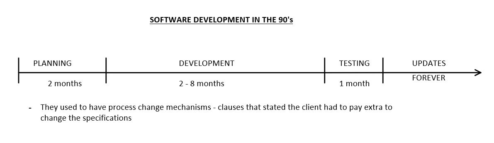
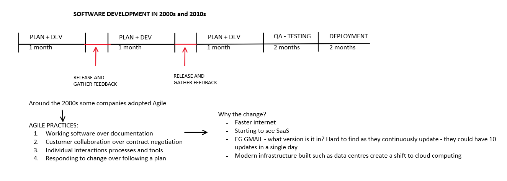
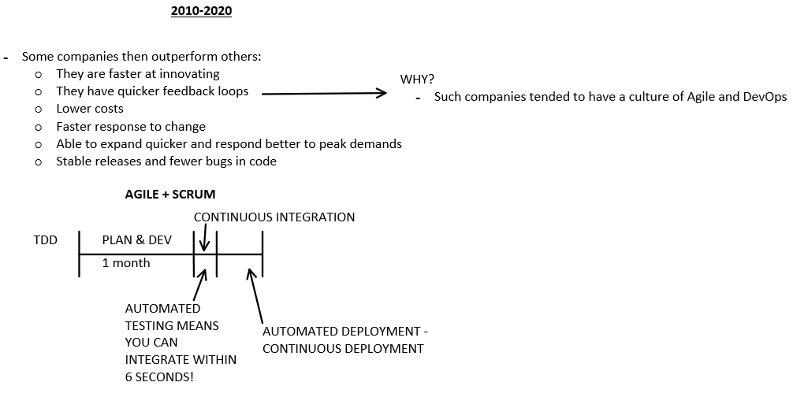
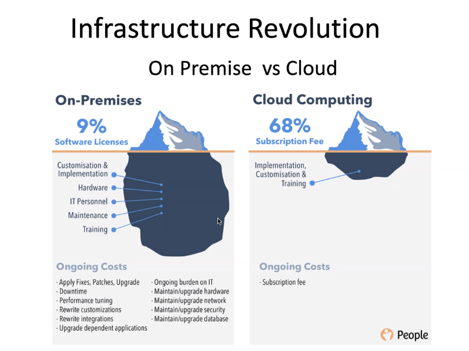
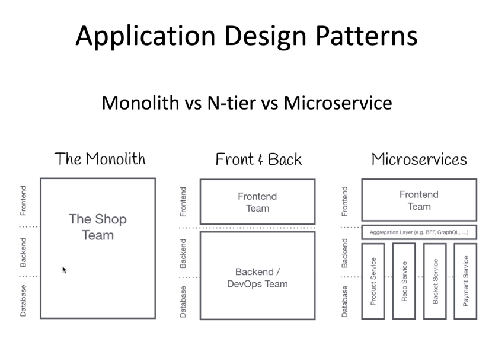
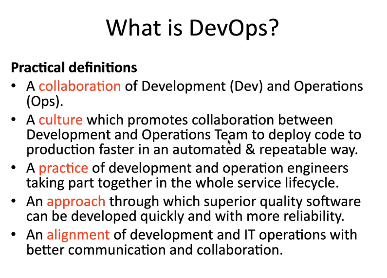
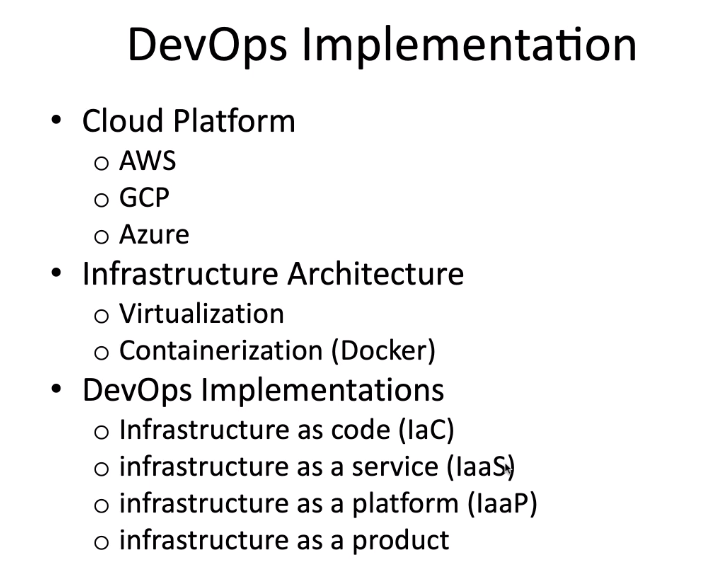
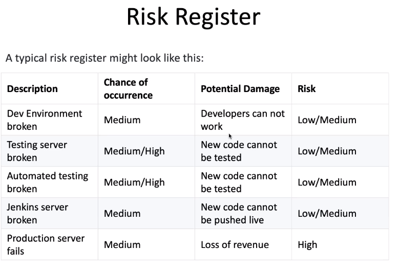
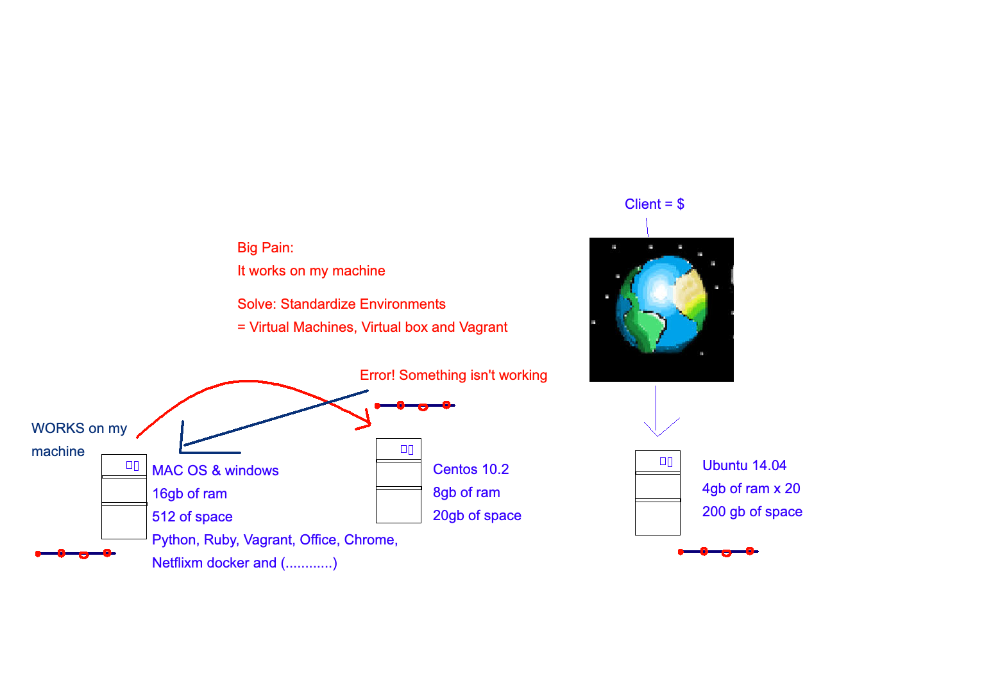

# DevOps

 

**History of DevOps**

  

  

  

 

**Why we need DevOps**

 

**What is DevOps**

- An internal culture:
  - CI/CD pipelines
  - Continuous testing
  - Standardised environments
  - Keeps costs low and allows growth to keep peak users in mind

 

**Four pillars of DevOps**
1. Ease of use
2. Flexibility
3. Robustness
4. Cost

 

**DevOps Lifecycle**
- Continuous integration, continuous delivery, continuous deployment

 

**Implementing DevOps**

 
 

# Dev Environments

 

**What is it?**
- This is where code runs
- Github is not an environment but virtualenv and computers etc. are environments

 

**What are the different ones?**
1. Development environments
2. Testing environments
3. Deployment/Live environments

- Code written will move between these different environments
- The Dev environment should mirror the testing and development environments to the best of it's abilities

 

**How to make such environments?**
- We will use Vagrant to create environments