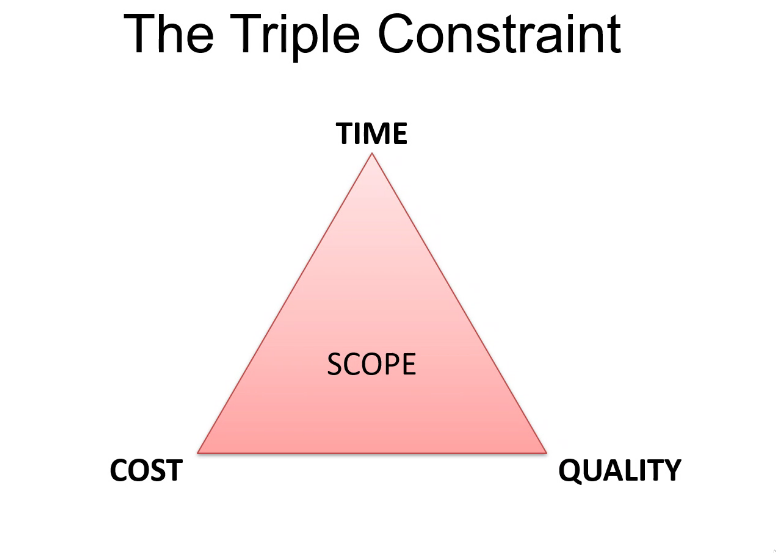

# Project environment
* Project vs. BAU
    * BAU = "Business as usual" 
    * Project refers to a task to be accomplished and is unique
    * BAU is ongoing whereas projects are usually restricted to a time-frame and could be entirely separate from BAU

* Triple constraint is:

    

    * One must choose what to compromise in terms of each other
    * For example, a higher quality product would most likely cost more and take more time
* The POPIT model = The Holistic model
    * Technology joins us all together

----
### Software Development Methodologies:

* Waterfall:

* V-model:

* Agile:

* Scrum framework:

Scrum is related to Agile

* Management plans and SDLCs (software development cycles)

---
### One team
* Attributes of mature teams:
    * They are located in the same place
    * They have cross-functional roles
    * Each role is self-organising and is accountable for their share of work
    * They test and learn feedback loops
* The usual roles are: PM (project manager), QA (quality assurance), UX (user experience designers), DEV's (developers), BA's (business analysts)

* Projects are difficult so try to:
    * Maintain a positive atmosphere
    * Manage conflict smartly
    * Have open and clear communication

----
### Making a project

* ROI (return of investment) is important and essential when considering the risk associated with the investment
* It all comes down to the value the product has to the people that need it (or use it)

---
### Risk
* It is important to identify risk to prevent potential disasters
* Some sources can be:
    * Technology 
    * Scope
    * Business
    * Economy
    * Potential competition

* Dealing with risk:
    * Avoid it altogether
    * Transfer who has to deal with the risk
    * Try to reduce it if it happens
    * Accept the risk (maybe if not too negative a risk)
    * Share the risk
    * Exploit the risk
    * Enhance the risk (aim to modify risk exposure)
    * Ignore the risk (must be justified if you do)

* A stakeholder is someone who is interested in the company e.g. customers, investors, workers, regulators, shareholders etc.

* Stakeholder attitudes:
    * Champions, supporters, neutral ones, critics, opponents and blockers
    * Champions fight for the cause of the project -- possibly through logical reasoning
    * Supporters aren't champions but still do support the cause, however they won't actively reason for it
    * Neutral is neutral
    * Critics will input things why not to do the project
    * Opponents actively against the project
    * Blockers are entirely against the project and do their best to stop it

----
### Exercises
* Presentation on Agile and Scrum:
    - Included: what they are, potential benefits, how it relates to DevOps, scrum artefacts, roles and ceremonies etc.
